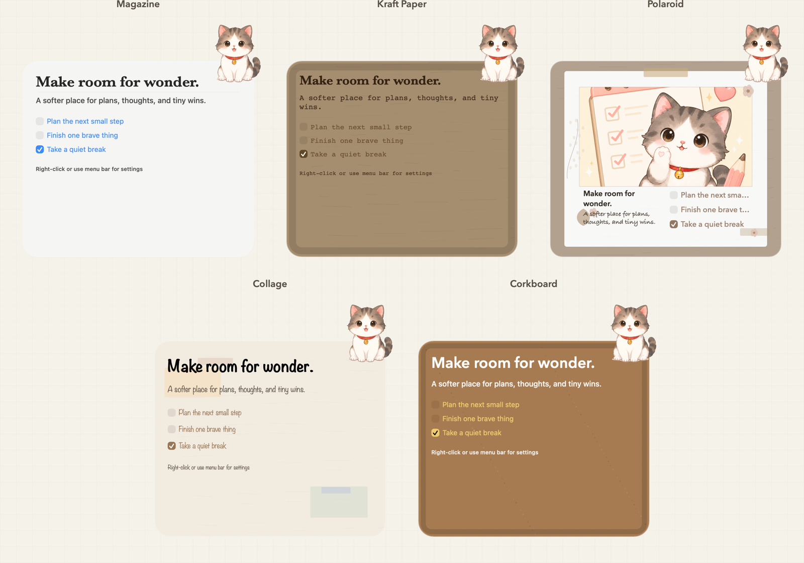
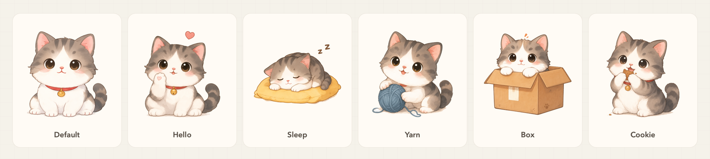

# Murmur

Murmur 是一款原生 macOS 桌面组件，把主文案、碎碎念、轻量待办和桌宠放进一个可定制的桌面角落。它强调低打扰、隐私保护和轻陪伴感，当前版本的内容与图片均保存在本机。

## 项目展示

### 多种主题



### 多种小猫姿态



## 核心功能

- **桌面内容组件**：展示主文案、碎碎念和可勾选的 to-do list。
- **隐私封面**：可使用文字或图片遮盖内容，也可以完全关闭封面。
- **多种主题**：内置杂志、牛皮纸、拍立得、拼贴和软木板风格，部分主题支持自定义背景。
- **动态桌宠**：提供多种小猫姿态与逐帧动画，可随组件位置切换左右贴边方向。
- **自定义桌宠**：上传图片后，使用 Apple Vision 在本机自动识别并抠除背景。
- **边缘吸附**：组件可吸附在屏幕两侧，并收起为仅显示桌宠的紧凑状态。
- **本地存储**：无需账号或云端服务，设置与内容默认写入 macOS Application Support。

## 技术栈

- Swift 6
- AppKit
- Vision 与 Core Image
- Swift Package Manager
- macOS 14+

## 本地运行

```bash
git clone https://github.com/cnst27dsjv-cell/Murmur.git
cd Murmur
swift run MurmurApp
```

打包为本地 `.app`：

```bash
bash scripts/package-dev-app.sh
open "dist/Murmur.app"
```

开发时如需将应用数据保存在项目目录，可使用：

```bash
MURMUR_DEV_DATA_DIR="$PWD/.murmur-dev-data" \
HOME="$PWD/.build-cache/home" \
CLANG_MODULE_CACHE_PATH="$PWD/.build-cache/clang" \
swift run --disable-sandbox --scratch-path "$PWD/.build-cache/swiftpm" MurmurApp
```

## 数据与隐私

- 应用状态默认保存在 `~/Library/Application Support/Murmur/`。
- 自定义桌宠的自动抠图在本机完成，不会上传图片。
- 仓库不包含用户数据、构建产物或本地 `.app` 包。

## 项目结构

```text
Sources/MurmurApp/       AppKit 应用源码
Resources/              图标、桌宠与动画资源
scripts/                动画帧处理与本地打包脚本
docs/superpowers/specs/  产品与功能设计记录
04_素材/                 原始桌宠素材
```

## 当前状态

Murmur 仍处于个人项目的持续开发阶段。目前以源码运行和本地开发包为主，尚未进行 Developer ID 签名、公证或 App Store 发布。

## License

本项目基于 [MIT License](LICENSE) 开源。
